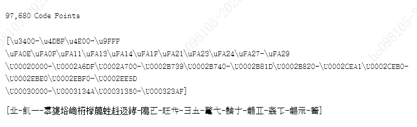

# Client-side input validation and client-server communication methods for Chinese characters

## Author:

* [Author 1]
* [Author 2]
* [etc.]

## Participate

[i18n-discuss](https://github.com/w3c/i18n-discuss/issues)

## Table of Contents

- [Client-side input validation and client-server communication methods for Chinese characters](#client-side-input-validation-and-client-server-communication-methods-for-chinese-characters)
   * [Author:](#author)
   * [Participate](#participate)
   * [Table of Contents](#table-of-contents)
   * [Introduction](#introduction)
   * [Goals](#goals)
   * [Proposal](#proposal)
      + [Client-side input validation for Chinese characters](#client-side-input-validation-for-chinese-characters)
         - [Optimisation of the rendering of missing-glyph Chinese characters](#optimisation-of-the-rendering-of-missing-glyph-chinese-characters)
         - [UI optimisation](#ui-optimisation)
         - [Filtering implementation](#filtering-implementation)
         - [Chinese input methods](#chinese-input-methods)
         - [Compatibility processing mechanism in client and server side](#compatibility-processing-mechanism-in-client-and-server-side)
   * [Key scenarios](#key-scenarios)
      + [Scenario 1](#scenario-1)
      + [Scenario 2](#scenario-2)
      + [Scenario 3](#scenario-3)
   * [Detailed design discussion](#detailed-design-discussion)
   * [Security Considerations](#security-considerations)
   * [Acknowledgements](#acknowledgements)
   * [References](#references)

## Introduction

The complete Unicode (ISO/IEC 10646) Chinese character set includes:

* The basic set (U+4E00-U+9FA5), i.e., ISO/IEC 10646:1993
* CJK Unified Ideographs Extension A, i.e., U+3400-U+4DB5 in ISO/IEC 10646:1999
* U+3400-U+9FFF (commonly known as Basic Multilingual Plane Chinese characters)
* U+20000-U+2FFFF, i.e., CJK Unified Ideographs Extension B to Extension F (Extension I in September 2023), commonly known as the Supplementary Ideographic Plane (SIP)
* U+30000-U+3FFFF, i.e., CJK Unified Ideographs Extension G to Extension H, commonly known as the Tertiary Ideographic Plane (TIP)
* the non-standard Private Use Area (PUA)
* CJK Compatibility Ideographs in the Basic Multilingual Plane (U+F900-U+FAFF). Only 12 of these code points are standard general-purpose Chinese characters.
* Unicode usually has unassigned code points at the end of each block. These deal with urgent Chinese characters until a block is filled. Then the unassigned code points of the next block will be used.

The current client-side input validation for Chinese is fragmented:

* Some use `[\u4e00-\u9fa5]` (20,902 characters in total) to restrict the input (equivalent to GBK).
* Some use `[\u3400-\u9fff]` (i.e., BMP) to restrict the input, which is equivalent to `utf8mb3` in MySQL.
* Some use GB 18030—2005 (limited to CJK Unified Ideographs Extension B only); GB 18030—2022 is limited to Extension F only, and does not include Extensions G, H, I, and code points at the end of the block.
* Various organisations and individuals have assigned their own PUA characters which have caused many negative impacts on the information exchange of digital services.

This proposal aims to standardise the client-side input restriction and validation, and the communication with the server, to improve the Unicode usage, and to update the related constraints in time with Unicode.

In client-server communication, appropriate prompts should be given for abnormalities entered at the client side, such as duplicate encoded ideographs, non-standard ideographs, PUA characters, and so on, to avoid the proliferation of errors.

## Goals

Using the latest version of Unihan as the basis, standardise Chinese digital data and continuously improve the standardisation process of Chinese.

As Chinese characters will be continuously added in Unicode, and the glyphs of desktop and mobile devices may lack of update when there is no glyph in the local fonts, the user agent should not display U+FFFD or blank to the user, and should display the code point (like the behaviour of Firefox under GNU/Linux).

## Proposal

What is described herein, contains the following pre-conditions:

* It is possible to enter all Chinese characters in Unicode. For not yet encoded Chinese characters, it is generally recommended to use the correct character splitting method to represent them (for example, use `钅监` or `⿰钅监` to represent the simplified version of U+30FAB `鑑`) to reduce ambiguity and facilitate future updates.
* Unicode characters without glyphs (including future code points for Chinese) should be displayed as the code point, instead of displaying blanks or tofu that make it impossible to distinguish between different characters.
* PUA characters are not recommended for use. This is especially true when multiple parties are using them for information exchange. However, if they are used, the assignments and glyphs should be disclosed to all users and the relevant fonts should be installed. For existing PUA characters, they should be converted to non-PUA characters periodically according to the frequency of Unicode updates.
* Full use should be made of the Chinese character code query tool to archive and provide query tools for split or PUA Chinese characters, in order to avoid duplicate encoded characters.
* Duplicate encoded ideographs in Unicode should be normalized in the same way as in the ctext project (see [Compatibility processing mechanism in client and server side](https://github.com/w3c/i18n-discuss/blob/gh-pages/notes/chinese-client-server.md#compatibility-processing-mechanism-in-client-and-server-side) and `[R7][R10]`).

### Client-side input validation for Chinese characters

Allow:

* [x] The input of all encoded Chinese characters in Unicode
  * `[\u4e00-\u9fff]`, i.e., Unicode 1.0 basic set and trailing urgent addition
  * `[\u3400-\u4dbf]`, i.e., CJK Unified Ideographs Extension A. The last 10 code points are very urgently needed characters.
  * `[\u20000-\u2ee5d]`, i.e., CJK Unified Ideographs Extension B-F and I
  * `[\u30000-\u323af]`, i.e., CJK Unified Ideographs Extension G-H
  * Keeping track of new Unicode versions
  * Note that very urgently needed characters may be added and encoded at the end of each block.
* [x] 12 code points in the CJK Compatibility Ideographs block included by Unicode `p{Ideo}`: 﨎﨏﨑﨓﨔﨟﨡﨣﨤﨧﨨﨩
* [x] Name separators (U+00B7 [·]) in personal name scenarios
* [x] In extreme cases, ideographic variation sequences may be used to display the correct variant glyph (e.g. Macau government services)

Restrictions:

* Restrict the input and use of other code points in the CJK Compatibility Ideographs block (e.g., those from Japanese character encodings);
* Restrict the use of Chinese characters in PUA and make the glyphs publicly available to all parties; set rules for Chinese characters in PUA to regularly track the latest Unicode release and migrate the data;
* Restrict the use of Kangxi radical characters to radical-specific areas. In general-purpose environments, only use the usual Chinese characters to avoid ambiguity and possible legal disputes, and to reduce additional communication costs.

#### Optimisation of the rendering of missing-glyph Chinese characters

Because of the continuous expansion of Unicode Chinese characters, many old systems won't have glyphs for some recently encoded Chinese characters. These characters are often displayed as `U+FFFD REPLACEMENT CHARACTER`, `U+2612 BALLOT BOX WITH X`, or blank, resulting in the user not being able to identify the specific content.

Firefox on Linux renders the code point in order to avoid mapping a glyph to thousands or tens of thousands of different Chinese characters, because it can not be recognised by the user normally.

#### UI optimisation

Where there are specification requirements, for variant characters (e.g., 戶 and 戶), wrongly written characters (e.g., 𪚔 should be 龑), duplicate encoded characters (e.g., U+363D and U+39B3 [㦳](https://ctext.org/dictionary.pl?if=en&char=%E3%A6%B3), only the former should be used after normalisation), PUA characters (e.g., in GBK-1995, U+E863 should be U+4DAE `䶮`), and compatibility ideographs other than the 12 characters mentioned above, etc., the necessary normalisation should be done, and users should be given sufficient hints. The hints have the following categories:

* PUA: If there is an official code point, the server should store it using the official code point and inform the user to use the official code point; if there is no official code point, the website or the user agent should suggest that it can't be used for the exchange of information, and should be replaced by using the correct character splitting method or pinyin.
* Irregular variants and compatibility ideographs: hints according to local language specifications
* Wrongly written characters: prompt to ask the user to use the correct standardised character
* Duplicate encoded characters: prompt to ask the user to use the correct character
* Kangxi radicals: in personal names and other non-radical use cases, ask the user to use the normal Chinese characters.

Another issue of concern is the IVS mechanism for handling variant characters. According to The Unicode Standard, variants can handled using VS1–VS16 (U+FE00 through U+FE0F) and VS17–VS256 (U+E0100 through U+E01EF):

* VS1-VS16 are only used for compatibility ideographs, 'Phags-pa letters, and emoji, generally called standardized variation sequences (SVS), of which VS15-VS16 are only used for emoji
* VS17-VS256 are used in ideographic variation sequences. Submissions to Unicode requires a a review period of 90 days.

Variation selectors and the previous code point should be rendered, printed, and processed as a single "character". Glyphs exist in the .ttf file in the form of Format 14. When doing string searching operations, the first code point should be the processing baseline. For example, if the two Chinese characters appear together, such as "龍VS天" (U+9F8D U+E0100 U+5929), typing "龍天" would find "龍VS天". The user agent can also have a method for precise query.

Typical examples of ideographic variation sequences are the HanaMinA/HanaMinB fonts and the Macao Supplementary Character Set `[R17]`.

#### Filtering implementation

This may vary from programming language to programming language, refer to `[R11-R14]` for generic JavaScript as an example.

1. UTF-16 surrogates method: use `[\uD800-\uDFFF]` for SIP and TIP, which can be difficult to handle when controlling the scope.
2. Character method: starting and ending Chinese characters such as `[一-龥]`, which uses UTF-8 encoding, but not intuitive enough from a readability perspective.
3. `u` flag method: `[\u{20000}-\u{3ffff}]` for SIP and TIP, easier to read
4. Unicode Script method, with the `u` flag:
  * `\p{UIdeo}`: all Unicode official Chinese characters, including 12 compatibility ideographs
  * `\p{Ideo}`: contains all Chinese characters in the compatibility block and Chinese characters in the SMP
  * `\p{Han}`: contains all Chinese characters and radicals in the compatibility block
  * `\p{PUA}`: Private Use Area in the Basic Multilingual Plane

Method 4 should be used.

Example of actual ranges of `\p{UIdeo}` in Unicode 15.1:

#### Chinese input methods

1. Ordinary keyboard input
2. Machine-readable digital input (such as NFC)
3. Handwriting input
4. OCR input
5. Voice input

3-5 are not within the scope of this project because they involve other technologies and cannot be accurate enough.

For #1, if Pinyin input cannot be used normally, it is recommended to add split-character Pinyin and shape-based input methods such as Wubi and Cangjie. In extreme cases, Unicode code point input can supported. For example, in Microsoft Pinyin IME, users can use `vuc20164` to input `𠅤`.

In modern life, more and more machine-readable methods are used for input (such as ID cards, electronic ID cards, QR codes, etc.), which should generally be completely transmitted to the server. The original information must not be lost due to encoding conversion, such as converting UTF-8 Chinese characters into GBK "?" (0x3F). For errors in the original the machine-readable information, the issuer should be contacted for correction.

#### Compatibility processing mechanism in client and server side

Since Unicode has [ghost characters](https://en.wikipedia.org/wiki/Ghost_characters) and duplicate encoded Chinese characters in its history, it is recommended to use the method similar to ctext.org to search for information related to Chinese characters and give clear and definite prompts for such characters, such as [㦳](https://ctext.org/dictionary.pl?if=en&char=%E3%A6%B3) in ctext will prompt:

> This character representation 㦳 (U+39B3) has been normalized to 㘽 (U+363D) in the CTP, and therefore does not appear in the database.

Processing mechanisms include:

1. Although the front end allows input, it will prompt
2. When writing back-end data, only formally standardized Chinese characters are entered into the database
3. Front-end query may be normalized to standard Chinese character query

Another good method is like many search engines, normalizing Simplified and Traditional Chinese in queries. For example, searching 为人民服务 or 爲人民服務 ("serve the people" in Simplified and Traditional Chinese) will find all Simplified and Traditional Chinese results.

This method has been used in handwriting, telegraph codes, and manual reading. In the digital era, every character has its own code point. Therefore, the "one character to one code point" process makes it impossible to find many variant characters. As a result, the information becomes "zombie information".

As shown in the figure above, Chinese telegraph code uses four-digit numbers to represent Chinese characters. `7115 2051 6671` corresponds to 陈伟达 in a Simplified Chinese environment, and 陳偉達 in a Traditional Chinese environment.

As for compatibility ideographs, only 12 of them are regular Chinese characters for input and storage. The other code points are generally treated as variant characters, as shown in `[R8]`: "U+2F8A6 (慈) is canonically equivalent to U+ 6148 (慈).”

For existing PUA Chinese character data, as mentioned in [Client-side input validation for Chinese characters](https://github.com/w3c/i18n-discuss/blob/gh-pages/notes/chinese-client-server.md#client-side-input-validation-for-chinese-characters), they should be checked and updated regularly (no more than 3 years after the new Unicode release). `[R5]`

## Key scenarios

There are three types of Chinese form input scenarios:

1. Internet real-name systems
2. Modern universal information exchange, such as ctext.org 
3. Chinese archaeology and philology

### Scenario 1

Modern personal name and place name scenarios:

* More than 10 million Chinese residents use characters not in Unicode.
* In a digital society, each person needs to deal with at least 10 other people, which involves hundreds of millions of people providing public and government services, and the ability to input, display, store, read, print, and exchange information is a basic requirement.
* The service industries employ over 10 million people. They require real-name network verification in accordance with anti-money-laundering regulations.
Historically, names of people and places were handwritten or spoken, but in a digital society, every character needs to be encoded.
* Since GB 2312, GBK, and Big5 encodings were used in the early days, a few missing characters were encoded with PUA, including 52 characters in GBK (later officially included in [CJK Unified Ideographs Extension A](https://www.unicode.org/charts/PDF/U3400.pdf)), 415 characters created by [Sogou Pinyin](https://en.wikipedia.org/wiki/Sogou_Pinyin), more than 4,700 characters created by Mainland China's Resident Identity Cards (more than 4,500 characters have been officially encoded in September 2023), more than 5,000 characters created by the Government of Hong Kong, and so on.
* The addition of Chinese characters in Unicode is a complicated project. Some characters are actually typos, called "ghost characters" (e.g. ⿺辵袁, which is really 遠), and some characters are duplicate encoded (e.g. 㖈 and 䎛、㦳 and 㘽, etc.), which need to be handled correctly in order to avoid legal disputes.
* General processing methods, such as the National Ethnic Affairs Commission `[R18]`, clearly state that only Chinese characters within the GB 18030 and GB 13000 standards are allowed to be used, and other characters not included in the standards are replaced by pinyin. Other livelihood service operating procedures `[R22]` state that personal names are not fully checked when using alternative approaches (split characters or pinyin) for PUA or other non-standard characters.
* Taiwan's household registration convention allows only the use of Chinese characters in a general dictionary, which may be 30,000-50,000 characters. The Korean character list for personal names contains 8,142 Hanja characters.

### Scenario 2

Modern generic information exchange scenarios:

* Generally refers to media such as news, radio, television, official documents, etc.
* Involving thousands to hundreds of millions of people
* Some old systems use GBK, for characters outside `[\u4e00-\u9fa5]`, blank or "?" is usually rendered. More recent systems generally use UTF-8: W3Techs states that 97.7% of the web is using the UTF-8 Unicode character encoding.
* Because of the support of fonts in platforms like Windows and mobile phones, they can only render characters within GB18030-2000 + Table of General Standard Chinese Characters (Chinese: 通用规范汉字表). Other characters may not be rendered.
* It is generally believed that the number of Chinese characters used in modern life is within 30,000-50,000 characters.
* When information is exchanged in the form of documents, it is generally possible to use PDF embedded fonts to avoid losing the glyphs.
* When exchanging information involving a small number of people, it is possible to install the same PUA font for all parties and exchange text information. PUA-encoded Chinese character-related information in the form of graphics or split characters should be conveyed.
* The use of ideographs encoded in the radical blocks is permitted under special conditions (e.g., editing of dictionaries, etc.). For example, there is no difference in the rendering between 生日 (official code points) and ⽣⽇ (radical code points), but the latter should not be used in general information exchange.

### Scenario 3

Chinese archaeology and philology scenarios:

* Limited to specialised research, involving an audience that may range from several to several thousand people
* When the text is complex, PUA in the BMP, Supplementary Private Use Area-A, and Supplementary Private Use Area-B may be used, and the number of PUA characters may be more than 100,000.
* When disclosed to the public, most of the relevant PUA text information is displayed in image form.

## Detailed design discussion

1. Following Unihan is a dynamic process. How to follow it? Can there be a requirement for timeframe?
  * 3-5 years after the publication of ISO/IEC 10646?
2. How to deal with duplicate encoded Chinese characters in Unihan?
  * Generally, the first encoded Chinese character is allowed, and the later encoded ones are normalised, like ctext.org.
  * Maybe do normalisation in the server side and prompt the user in the client side.
3. Is PUA allowed? How is it handled?
  * PUA is not allowed by common standards, regulations, and industry standards. Most of these characters are processed by using splitting characters or pinyin instead.
  * For every Unicode release, the conversion to official code points should be checked in time, and relevant updates should be completed within 1-3 years.
4. How to deal with Simplified and Traditional Chinese correspondence similar to telegraph codes?
  * Maybe process in the server side
5. How to deal with ancient characters?
  * Modern real-name systems should have a special character set to reduce the processing difficulty.
6. How to deal with compatibility ideographs?
  * Unicode recognises only 12 common Chinese compatibility ideographs, and most of the other ideographs are Japanese-specific and are only used in Japan.
7. How are typos handled?
  * Generally, it is necessary to hint the user to avoid further proliferation of the character.
8. Special Characters
  * Fullwidth Latin letters and halfwidth Latin letters: generally, halfwidth letters should be used. They are easier to input and take up less space.
  * Name separators (U+00B7 [·]) should be used in personal name scenarios according to `[R18]`
  * U+3007 [〇] should not be used. 零 should be used instead.
9. Method of displaying Chinese characters without glyphs or with the same glyphs but in different code points
  * in GNU/Linux, the code point is rendered
  * Firefox under Windows also uses this and it is recommended to use this method
  * Currently, the rendering in different mobile phones and apps varies: blank, U+FFFD, Hong Kong Private Character Set characters, emoji, and so on.
  * For characters with duplicated code points and radical code points, a clear distinction of the glyph should be made, like 张䶮/张 and 工人/⼯⼈.
10. Design of the evaluation mechanism

Client side:

* Can the user input of the full character set in the service area?
* When there are multiple parties, do all parties use the same method of text processing?
* If the font is not aligned, is there support for displaying missing glyphs as the code point to differentiate them?
* Is the client-side input fully transmitted to the server? For example, if it's not fully transmitted, such as UTF-8 encoded content is transmitted via the GBK channel, characters not in GBK will be converted to "?" characters.
* Can display and printing be handled properly?

Server side:

* How many standard Chinese characters are there? What are their frequency and the distribution of each extension block outside BMP?
* What is the back-end normalisation and alerting method for duplicates and ghost characters?
* Do PUA characters exist, and how many are known to all parties?
* Is there a mechanism for regular reporting and correction of PUA characters?

## Security Considerations

Client-side input validation has the following security benefits:

1. Avoid invalid and incorrect inputs frequently requesting the back-end service interface.
Invalid and incorrect user input can be validated and processed in the client side to ensure that the data submitted to the server is in line with the rules.

2. Increase the difficulty of XSS attacks.
Relying on the computing power of the front-end, validation and filtering of user input information at the front-end, followed by encrypting the data and passing it to the back-end, and then strict validation by the back-end service, is the basic practice of XSS attack prevention. Attackers need to read the client-side code to understand its logic before attempting to bypass it, which to some extent can increase the implementation cost of XSS attacks.

## Acknowledgements

Many thanks for valuable feedback and advice from:

* Eiso Chan  (Culture and Art Publishing House)
* Fuqiao Xue (W3C)

## References

1. Ken Whistler. Unicode Normalization Forms. 12 August 2023. Unicode Standard Annex #15. URL: https://www.unicode.org/reports/tr15/tr15-54.html
2. Mark Davis. Unicode Regular Expressions. 8 February 2022. Unicode Technical Standard #18. URL: https://www.unicode.org/reports/tr18/tr18-23.html
3. [Regular-Expressions.info](https://www.regular-expressions.info/)
4. [Unicode汉字正则表达式方法比较](https://zhuanlan.zhihu.com/p/537245858)
5. [PUA](https://wiki.suikawiki.org/n/PUA#gsc.tab=0) ([Chinese version](https://zhuanlan.zhihu.com/p/360408639))
6. Addison Phillips et al. Character Model for the World Wide Web: String Matching Section 2.2.1 Canonical vs. Compatibility Equivalence. 11 August 2021. W3C Note. URL: https://www.w3.org/TR/charmod-norm/#canonical_compatibility
7. P. Hoffman; M. Blanchet. Preparation of Internationalized Strings ("stringprep"). December 2002. Proposed Standard. URL: https://www.rfc-editor.org/rfc/rfc3454 See also: P. Saint-Andre; M. Blanchet. PRECIS Framework: Preparation, Enforcement, and Comparison of Internationalized Strings in Application Protocols. October 2017. Proposed Standard. URL: https://www.rfc-editor.org/rfc/rfc8264
8. [Unicode等价性与正规化](https://medium.com/@wanxiao1994/unicode%E7%AD%89%E4%BB%B7%E6%80%A7%E4%B8%8E%E6%AD%A3%E8%A7%84%E5%8C%96-2eb50b343bc1)
9. [标准中文电码查询 by NJStar](https://www.njstar.com/tools/telecode/search_cn.php)
10. [ctext.org漢字標準化實例](https://zhuanlan.zhihu.com/p/651291004)
11. 姓名生僻字应用的困境与对策，艾卓码，信息技术与标准化,2021(10)
12. 正则表达式作用于汉字姓名生僻字方法初探，马良有，金融电子化，2021.10
13. 姓名生僻字的银行标准化实践和建议，纪熙东、李言平，第十六届中国标准化论坛论文集，2019
14. [Unicode Utilities: Regex](https://util.unicode.org/UnicodeJsps/regex.jsp): regular expressions synchronised with Unicode and ICU
15. Ken Lunde. [Ideographic Variation Sequences
Implementation Details](https://ccjktype.fonts.adobe.com/wp-content/uploads/2017/09/iuc31-lunde-s8t1.pdf). 17 October 2017.
16. Eiso Chan. [IVS Test Page](https://xfq.github.io/testing/ivs/ivs.xml). October 2023.
17. [澳門特別行政區資訊系統中文編碼統一方案 Proposta de uniformização da codificação dos caracteres chineses dos sistemas informáticos da Região Administrativa Especial de Macau](https://g2e.gov.mo/zh-hant/content/chncode-extdoc/)
18. 民委发[2016]33号文《[关于在政府管理和社会公共服务信息系统中统一姓名采集应用规范的通知](https://www.gov.cn/xinwen/2016-05/09/content_5071481.htm)》
19. Richard Ishida. [Character encodings: Essential concepts](https://www.w3.org/International/articles/definitions-characters/). URL: https://www.w3.org/International/articles/definitions-characters/
20. [Ghost characters](https://en.wikipedia.org/wiki/Ghost_characters). See also: [A Spectre is Haunting Unicode](https://www.dampfkraft.com/ghost-characters.html).
21. [The Unicode Standard](https://www.unicode.org/versions/latest/). URL: https://www.unicode.org/versions/latest/
22. [广东省人力资源和社会保障厅关于印发《广东省社会保障卡业务经办规程（第二版）》的通知](https://hrss.gd.gov.cn/slh/zcfgk/content/post_4171329.html)

23. Duplicate encoded ideographs: when China Electronics Standardization Institute (CESI) solicited feedback on GB 13000 in December 2023, the following 22 pairs were confirmed (generally, the one with a smaller code point should be used):

| **Seq** | **U1**  | **C1** | **U2**  | **C2** |
|---------|---------|--------|---------|--------|
| 1       | U+5E50  | 幐     | U+3B3A  | 㬺     |
| 2       | U+8416  | 萖     | U+26BF5 | 𦯵     |
| 3       | U+9094  | 邔     | U+2866C | 𨙬     |
| 4       | U+34A8  | 㒨     | U+20457 | 𠑗     |
| 5       | U+3588  | 㖈     | U+439B  | 䎛     |
| 6       | U+363D  | 㘽     | U+39B3  | 㦳     |
| 7       | U+3DB7  | 㶷     | U+2420E | 𤈎     |
| 8       | U+FA23  | 﨣     | U+27EAF | 𧺯     |
| 9       | U+2028D | 𠊍     | U+28940 | 𨥀     |
| 10      | U+204F2 | 𠓲     | U+23515 | 𣔕     |
| 11      | U+21018 | 𡀘     | U+2103C | 𡀼     |
| 12      | U+21F37 | 𡼷     | U+2439A | 𤎚     |
| 13      | U+23F41 | 𣽁     | U+23F9E | 𣾞     |
| 14      | U+23761 | 𣝡     | U+237BC | 𣞼     |
| 15      | U+24425 | 𤐥     | U+2444B | 𤑋     |
| 16      | U+249BC | 𤦼     | U+249E9 | 𤧩     |
| 17      | U+24BD2 | 𤯒     | U+2A415 | 𪐕     |
| 19      | U+22472 | 𢑲     | U+26133 | 𦄳     |
| 19      | U+2633D | 𦌽     | U+27B80 | 𧮀     |
| 20      | U+26B60 | 𦭠     | U+26B6B | 𦭫     |
| 21      | U+2947F | 𩑿     | U+2948B | 𩒋     |
| 22      | U+29FCE | 𩿎     | U+29FD7 | 𩿗     |

